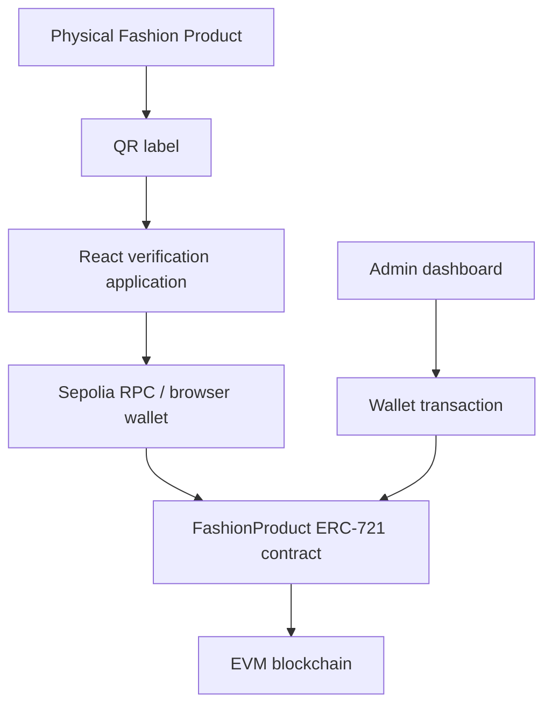

# FashionChain

Blockchain-based physical-product authentication and digital ownership system. This fictional portfolio MVP demonstrates a fashion product's persistent digital identity through an EVM ERC-721 contract. **SABRINAGOH is used only as a fictional demo brand; this project has no affiliation, endorsement, or commercial relationship with SABRINAGOH.**

## Problem and solution

Counterfeits and disconnected product records make it difficult to validate a physical item's origin and current digital owner. FashionChain mints one NFT-backed identity per registered physical item. A QR code resolves a product ID to an on-chain record; the verification page reads the contract and reports whether that record exists and is active. The blockchain record represents the item's **digital identity**, not a physical anti-counterfeit guarantee by itself.

## Architecture



## Features

- ERC-721 product identities with OpenZeppelin implementations
- Unique on-chain product IDs and structured product fields
- Public on-chain verification and active/inactive status
- Role-restricted manufacturing mint flow and retained invalidation history
- Standard ERC-721 digital ownership transfers
- MetaMask connection, network validation, transaction feedback
- Verification QR generation after minting
- Responsive React/TypeScript interface
- Automated Hardhat tests for permissions, minting, duplicates, verification, status and transfers

## Project structure

```text
contracts/FashionProduct.sol  ERC-721 registry
test/FashionProduct.ts        Contract test suite
scripts/deploy.ts             Sepolia deployment script
frontend/                     Vite + React static app
metadata/                     Sample fictional metadata
SECURITY.md                   Threat model and limitations
```

## Technology

Solidity 0.8.24, OpenZeppelin Contracts, Hardhat, TypeScript, ethers v6, React, Vite, Tailwind CSS, React Router, QRCode React, and Sepolia.

## Contract design

`FashionProduct` uses `ERC721URIStorage` and `AccessControl`. `MINTER_ROLE` is required to call `mintProduct`; product IDs map once to their token ID and cannot be duplicated. `verifyProduct` returns product data and owner after checking token existence. The admin can deactivate an item without burning it, retaining historical traceability. Native ERC-721 `ownerOf`, `transferFrom`, and `safeTransferFrom` provide ownership behavior.

Gas choices: the product-ID lookup uses a mapping; immutable history is emitted in events; only essential verification fields are stored on-chain. Human-readable strings cost gas, intentionally accepted here for a transparent portfolio MVP.

## Local setup

```bash
npm install
cp .env.example .env
npm run compile
npm test
npm run coverage
npm run frontend:dev
```

For the frontend, create `frontend/.env` (it is ignored via the root rule) with values such as:

```dotenv
VITE_RPC_URL=https://ethereum-sepolia-rpc.publicnode.com
VITE_CONTRACT_ADDRESS=0xYourDeployedContract
VITE_CHAIN_ID=11155111
VITE_APP_URL=http://localhost:5173
```

Build the static app with `npm run frontend:build`.

### Vercel hosting

Import the GitHub repository into Vercel and set the project **Root Directory** to `frontend`. Vercel will use the frontend package's `npm run build` command and publish `dist`. Add these environment variables in Vercel's Production environment, then redeploy:

```dotenv
VITE_RPC_URL=https://your-sepolia-rpc-provider/v2/your-public-browser-key
VITE_CONTRACT_ADDRESS=0xYourDeployedContract
VITE_CHAIN_ID=11155111
VITE_APP_URL=https://your-project.vercel.app
```

`frontend/vercel.json` rewrites verification URLs to the React application, so QR links such as `/verify/SG-JKT-000001` work on direct visits. Vite variables are embedded at build time: do not put private keys or other secrets in them. Restrict the browser RPC key by origin and rate limit in the RPC provider dashboard.

## Sepolia deployment

Set `SEPOLIA_RPC_URL` and `DEPLOYER_PRIVATE_KEY` in the root `.env`, fund the deployer with Sepolia ETH, then run:

```bash
npm run deploy:testnet
```

Copy the printed address to `frontend/.env`, rebuild the frontend, and use the resulting static files with any static host. Deployment status at repository creation: **not deployed**—no funded deployer credentials are included. Therefore, there is no contract address or live frontend URL to claim yet.

## Security

Read [SECURITY.md](SECURITY.md). This is unaudited demo code. Product ID registration depends on a trusted manufacturer, and a copied QR label is not proof of an original physical item.

## Future improvements

NFC challenge-response labels, supply-chain events, ERC-1155 batch assets, Shopify integration, decentralized content-addressed metadata, blockchain event indexing, multi-chain support, crypto payments, and enterprise multisig role management.
